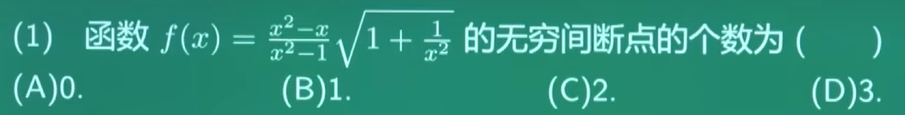
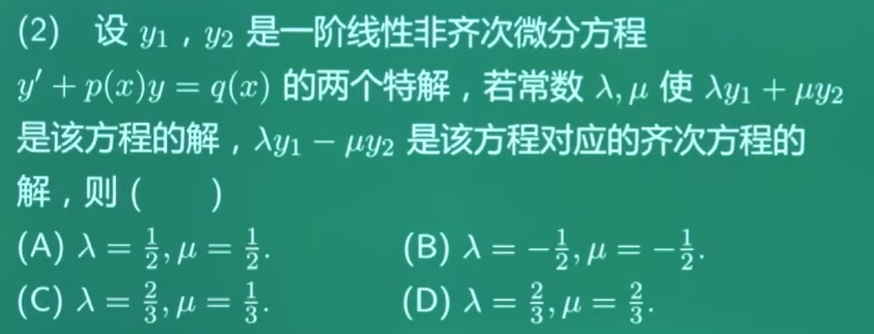

- 

- 什么是：一阶线性微分方程？y′+p(x)y=q(x) <= 这个就是
  - 只有y的一阶导数y′，没有二阶 / 更高阶导数
  - y′和y都是一次方，没有y平方、y⋅y′这种项
- 什么是：线性齐次微分方程？q(x) = 0，y′+p(x)y=0 <= 这个就是
  - 「齐次」的本质：方程里的每一项，关于y和它的导数的次数都是一样的（这里都是 1 次），而且右边的常数项为 0
  - 它的解有个关键性质：如果y1、y2是它的解，那么C1y1+C2y2（C1,C2是常数）也一定是它的解，这叫「解的叠加性」
- 什么是：线性非齐次微分方程？q(x) ≠ 0
  - 右边的\(q(x)\)不恒等于 0，相当于给齐次方程加了个 “外力项”
  - 它的解 = 对应齐次方程的通解 + 非齐次方程的一个特解，这就是我们常说的「通解结构」
- 题目说：λy1+μy2是该方程的解，该方程是什么：一阶线性非齐次微分方程，那么λy1+μy2是非齐次方程的解
  - (λy1+μy2)′+p(x)(λy1+μy2)=q(x) => λy1′ + μy2′ + p(x)λy1 + p(x)μy2 = q(x) => λ(y1′ + p(x)y1) + μ(y2′ + p(x)y2)
  - 因为y1，y2是非齐次方程的两个特解，所以：y1′ + p(x)y1 = q(x)，y2′ + p(x)y2 = q(x)
  - 所以λq(x) + μq(x) = q(x)，所以λ + μ = 1
- 因为λy1-μy2是该方程对应齐次方程的解，所以：(λy1-μy2)′ + p(x)(λy1-μy2) = 0 => λy1′ - μy2′ + p(x)λy1 - p(x)μy2 = 0
  - λ(y1′ + p(x)y1) - μ(y2′ + p(x)y2) = 0
  - 因为：y1′ + p(x)y1 = q(x)，y2′ + p(x)y2 = q(x)
  - 所以：λq(x) - μq(x) = 0，等式两边同时除以q(x) => λ - μ = 0
- λ = μ，2λ = 1，2μ = 1，所以λ = 1/2，μ = 1/2，选A
