- 什么是间断点：搞明白间断点要先搞明白什么是：“连续”
  - **连续函数**的定义：函数 \(y=f(x)\) 在点 \(x=x_0\) 连续，必须同时满足 3 个条件：
    1. \(f(x_0)\) 有定义
    2. \(\lim_{x \to x_0} f(x)\) 存在
    3. \(\lim_{x \to x_0} f(x) = f(x_0)\)
  - **任意一条不满足**，函数在 \(x=x_0\) 就**不连续**，这个点就叫**间断点**。
- 第一类间断点：左右极限都存在
  - **可去间断点**：左右极限都存在且相等，但 \(f(x_0)\) 没定义，或极限值≠函数值。
  - **跳跃间断点**：左右极限都存在，但不相等

- 第二类间断点：左右极限至少有一个不存在
  - **无穷间断点**：左右极限中，至少有一个是 \(+\infty\) 或 \(-\infty\)
  - **振荡间断点**：函数在该点附近无限次振荡，极限不存在

- 先要找出可疑点：题中，x≠±1，x≠0，三个可疑点
- 然后进行化简：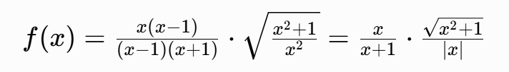
- 当x无限趋近于1时：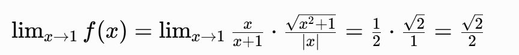
  - 左右极限存在，且相等，但是f(1)没定义，所以是可去间断点
- 当x无限趋近于0时，要分左右去讨论，为什么因为绝对值
  - 当 \(x>0\) 时，\(|x| = x\)
  - 当 \(x<0\) 时，\(|x| = -x\)，当x大于0是 |x|=x，我们可以理解，为什么小于0，是-x，比如x = -2，那么-2的绝对值是2=-(-2)
  - 当x无限趋近于+0：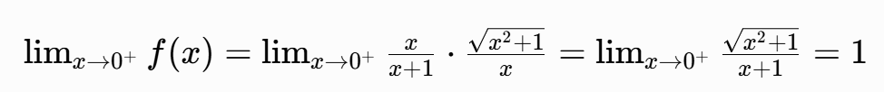
  - 当x无限趋近于-0：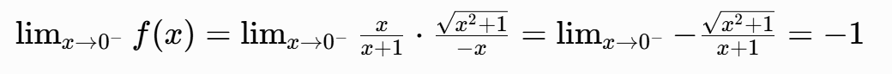
  - 左右极限都存在，但是不想等，所以是跳跃间断点
- 当x无限趋近于-1时：也要分左右进行讨论，因为：x+1，
  - 如果无限趋近于右-1，那么x+1 > 0
  - 如果无限趋近于左-1，那么x+1 < 0
  - 当x无限趋近于右-1：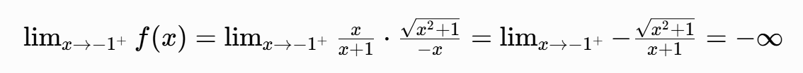
  - 当x无限趋近于左-1：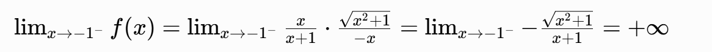
  - 左右极限均为无穷大，因此 \(x=-1\) 是**无穷间断点**。

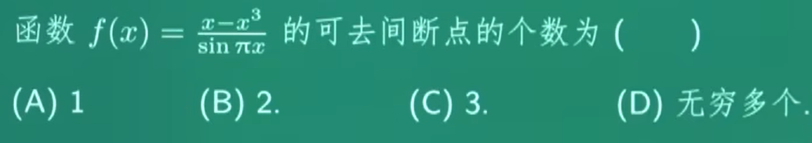

- sinx的图

  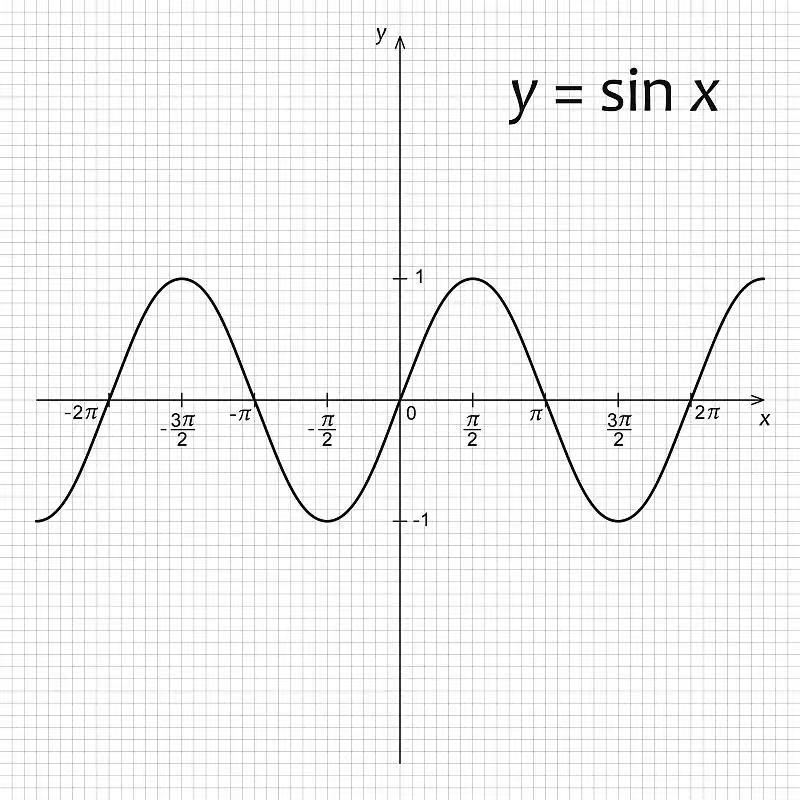

- 寻找可疑点，首先分母不能为0，sinπx≠0，所以可以点就是0、±1、±2......

- 有一个知识要知道：

  - 当 \(t \to 0\) 时，\(\sin t \sim t\)
  - 这个结论来自重要极限：\(\lim_{t \to 0} \frac{\sin t}{t} = 1\)
    - 也就是说，当 t 无限趋近于 0 时，\(\sin t\) 和 t 几乎是 “一样大” 的，所以可以互相替换

- 当x无限趋近于0时：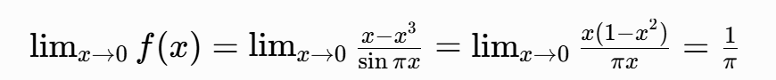

  - 极限存在，是可去间断点

- 当x无限趋近于1时：

  - 分子：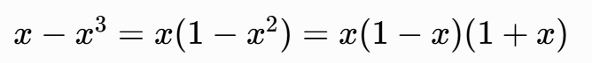
  - 看到分子是这样，我们应该想到如果把某一项和分母一起约掉是最好的，所以要对分母做一下换元，让其出现(1-x)或(1+x)
  - 还有一个可以想到的是，令t = x- 1，当x无限趋向于1的时候，t无限趋向于0，所以：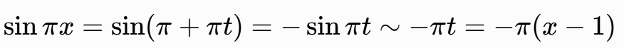
    - 为什么sin(π + πt) = -sinπt，比如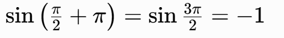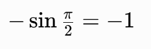
    - sin(0+π)=sinπ=0=-0=-sinπ
    - \(\sin(\pi+\alpha) = -\sin\alpha\)
    - \(\sin(\pi-\alpha) = \sin\alpha\)
    
  - 最终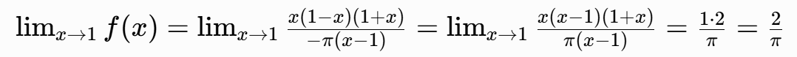
  - 极限存在，是可去间断点

- 当x无限趋近于-1时

  - 令t=x+1，t无限趋近于0：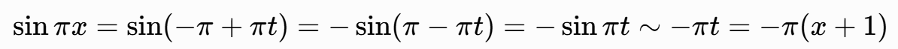
  - 最终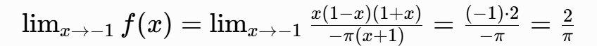
  - 极限存在，是可去间断点

- 当x无限趋近于±2、±3......的时候

  - 因为分子：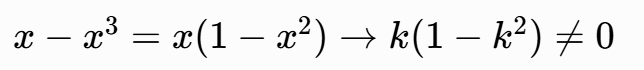
  - 且分母：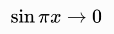
  - 所以：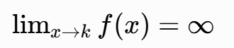
  - 极限不存在，是**无穷间断点**，不是可去间断点。

- 选C

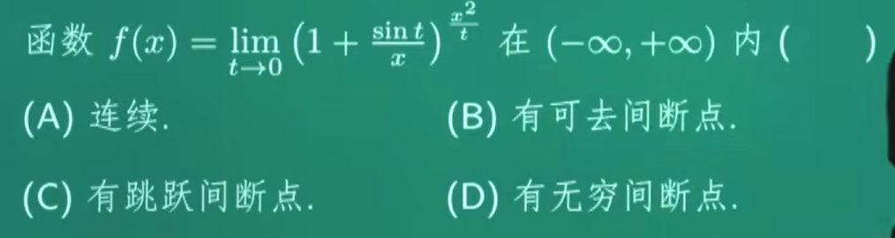

- 现象可疑点：x ≠ 0，因为x是分母
- 看到这样的式子，就应该想到 \(1^\infty\) 型极限，我们用重要极限公式：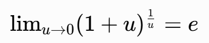

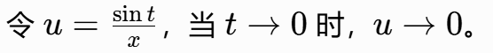

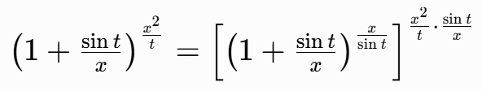

- 先算指数部分：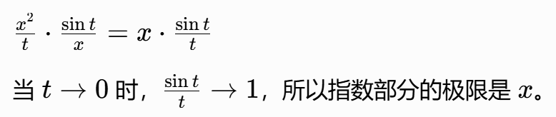
- 再算底数部分：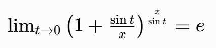
- 因此，整个极限为：\(f(x) = e^x \quad (x \neq 0)\)
- 当x无限趋近于0时：\(\lim_{x \to 0} f(x) = \lim_{x \to 0} e^x = e^0 = 1\)
  - 极限存在切为有限值，所以是可去间断点
- 选B

- 什么是：一阶线性微分方程？y′+p(x)y=q(x) <= 这个就是
  - 只有y的一阶导数y′，没有二阶 / 更高阶导数
  - y′和y都是一次方，没有y平方、y⋅y′这种项
- 什么是：线性齐次微分方程？q(x) = 0，y′+p(x)y=0 <= 这个就是
  - 「齐次」的本质：方程里的每一项，关于y和它的导数的次数都是一样的（这里都是 1 次），而且右边的常数项为 0
  - 它的解有个关键性质：如果y1、y2是它的解，那么C1y1+C2y2（C1,C2是常数）也一定是它的解，这叫「解的叠加性」
- 什么是：线性非齐次微分方程？q(x) ≠ 0
  - 右边的\(q(x)\)不恒等于 0，相当于给齐次方程加了个 “外力项”
  - 它的解 = 对应齐次方程的通解 + 非齐次方程的一个特解，这就是我们常说的「通解结构」
- 题目说：λy1+μy2是该方程的解，该方程是什么：一阶线性非齐次微分方程，那么λy1+μy2是非齐次方程的解
  - (λy1+μy2)′+p(x)(λy1+μy2)=q(x) => λy1′ + μy2′ + p(x)λy1 + p(x)μy2 = q(x) => λ(y1′ + p(x)y1) + μ(y2′ + p(x)y2)
  - 因为y1，y2是非齐次方程的两个特解，所以：y1′ + p(x)y1 = q(x)，y2′ + p(x)y2 = q(x)
  - 所以λq(x) + μq(x) = q(x)，所以λ + μ = 1
- 因为λy1-μy2是该方程对应齐次方程的解，所以：(λy1-μy2)′ + p(x)(λy1-μy2) = 0 => λy1′ - μy2′ + p(x)λy1 - p(x)μy2 = 0
  - λ(y1′ + p(x)y1) - μ(y2′ + p(x)y2) = 0
  - 因为：y1′ + p(x)y1 = q(x)，y2′ + p(x)y2 = q(x)
  - 所以：λq(x) - μq(x) = 0，等式两边同时除以q(x) => λ - μ = 0
- λ = μ，2λ = 1，2μ = 1，所以λ = 1/2，μ = 1/2，选A
