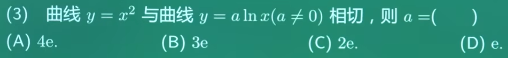
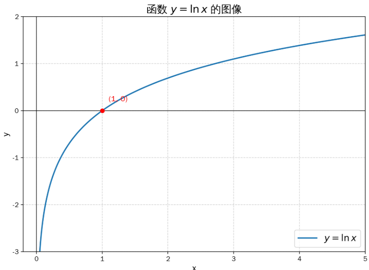
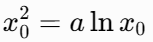
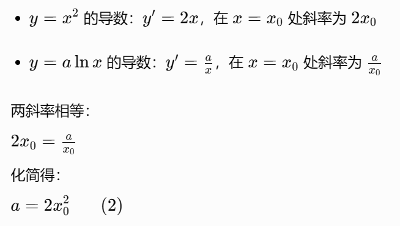
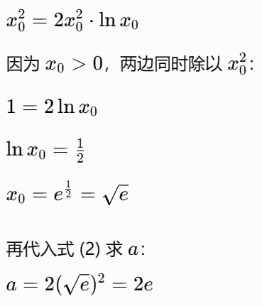
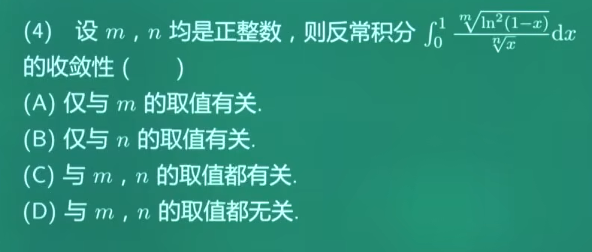

- 什么是间断点：搞明白间断点要先搞明白什么是：“连续”
  - **连续函数**的定义：函数 \(y=f(x)\) 在点 \(x=x_0\) 连续，必须同时满足 3 个条件：
    1. \(f(x_0)\) 有定义
    2. \(\lim_{x \to x_0} f(x)\) 存在
    3. \(\lim_{x \to x_0} f(x) = f(x_0)\)
  - **任意一条不满足**，函数在 \(x=x_0\) 就**不连续**，这个点就叫**间断点**。
- 第一类间断点：左右极限都存在
  - **可去间断点**：左右极限都存在且相等，但 \(f(x_0)\) 没定义，或极限值≠函数值。
  - **跳跃间断点**：左右极限都存在，但不相等

- 第二类间断点：左右极限至少有一个不存在
  - **无穷间断点**：左右极限中，至少有一个是 \(+\infty\) 或 \(-\infty\)
  - **振荡间断点**：函数在该点附近无限次振荡，极限不存在

- 先要找出可疑点：题中，x≠±1，x≠0，三个可疑点
- 然后进行化简：
- 当x无限趋近于1时：
  - 左右极限存在，且相等，但是f(1)没定义，所以是可去间断点
- 当x无限趋近于0时，要分左右去讨论，为什么因为绝对值
  - 当 \(x>0\) 时，\(|x| = x\)
  - 当 \(x<0\) 时，\(|x| = -x\)，当x大于0时 |x|=x，我们可以理解，为什么小于0，是-x，比如x = -2，那么-2的绝对值是2=-(-2)
  - 当x无限趋近于+0：
  - 当x无限趋近于-0：
  - 左右极限都存在，但是不想等，所以是跳跃间断点
- 当x无限趋近于-1时：也要分左右进行讨论，因为：x+1，
  - 如果无限趋近于右-1，那么x+1 > 0
  - 如果无限趋近于左-1，那么x+1 < 0
  - 当x无限趋近于右-1：
  - 当x无限趋近于左-1：
  - 左右极限均为无穷大，因此 \(x=-1\) 是**无穷间断点**
- 选B

- sinx的图

  

- 寻找可疑点，首先分母不能为0，sinπx≠0，所以可疑点就是0、±1、±2......

- 有一个知识要知道：

  - 当 \(t \to 0\) 时，\(\sin t \sim t\)
  - 这个结论来自重要极限：\(\lim_{t \to 0} \frac{\sin t}{t} = 1\)
    - 也就是说，当 t 无限趋近于 0 时，\(\sin t\) 和 t 几乎是 “一样大” 的，所以可以互相替换

- 当x无限趋近于0时：

  - 极限存在，是可去间断点

- 当x无限趋近于1时：

  - 分子：
  - 看到分子是这样，我们应该想到如果把某一项和分母一起约掉是最好的，所以要对分母做一下换元，让其出现(1-x)或(1+x)
  - 还有一个可以想到的是，令t = x- 1，当x无限趋向于1的时候，t无限趋向于0，所以：
    - 为什么sin(π + πt) = -sinπt，比如
    - sin(0+π)=sinπ=0=-0=-sinπ
    - \(\sin(\pi+\alpha) = -\sin\alpha\)
    - \(\sin(\pi-\alpha) = \sin\alpha\)
    
  - 最终
  - 极限存在，是可去间断点

- 当x无限趋近于-1时

  - 令t=x+1，t无限趋近于0：
  - 最终
  - 极限存在，是可去间断点

- 当x无限趋近于±2、±3......的时候

  - 因为分子：
  - 且分母：
  - 所以：
  - 极限不存在，是**无穷间断点**，不是可去间断点。

- 选C

- 寻找可疑点：x ≠ 0，因为x是分母
- 看到这样的式子，就应该想到 \(1^\infty\) 型极限，我们用重要极限公式：

- 先算指数部分：
- 再算底数部分：
- 因此，整个极限为：\(f(x) = e^x \quad (x \neq 0)\)
- 当x无限趋近于0时：\(\lim_{x \to 0} f(x) = \lim_{x \to 0} e^x = e^0 = 1\)
  - 极限存在且为有限值，所以是可去间断点
- 选B

- 什么是：一阶线性微分方程？y′+p(x)y=q(x) <= 这个就是
  - 只有y的一阶导数y′，没有二阶 / 更高阶导数
  - y′和y都是一次方，没有y平方、y⋅y′这种项
- 什么是：线性齐次微分方程？q(x) = 0，y′+p(x)y=0 <= 这个就是
  - 「齐次」的本质：方程里的每一项，关于y和它的导数的次数都是一样的（这里都是 1 次），而且右边的常数项为 0
  - 它的解有个关键性质：如果y1、y2是它的解，那么C1y1+C2y2（C1,C2是常数）也一定是它的解，这叫「解的叠加性」
- 什么是：线性非齐次微分方程？q(x) ≠ 0
  - 右边的\(q(x)\)不恒等于 0，相当于给齐次方程加了个 “外力项”
  - 它的解 = 对应齐次方程的通解 + 非齐次方程的一个特解，这就是我们常说的「通解结构」
  - 这里还要补充一下，题目已经隐藏告诉我们q(x)一定不能为零，为后面约掉q(x)提供支持
- 题目说：λy1+μy2是该方程的解，该方程是什么：一阶线性非齐次微分方程，那么λy1+μy2是非齐次方程的解
  - (λy1+μy2)′+p(x)(λy1+μy2)=q(x) => λy1′ + μy2′ + p(x)λy1 + p(x)μy2 = q(x) => λ(y1′ + p(x)y1) + μ(y2′ + p(x)y2)
  - 因为y1，y2是非齐次方程的两个特解，所以：y1′ + p(x)y1 = q(x)，y2′ + p(x)y2 = q(x)
  - 所以λq(x) + μq(x) = q(x)，所以λ + μ = 1
- 因为λy1-μy2是该方程对应齐次方程的解，所以：(λy1-μy2)′ + p(x)(λy1-μy2) = 0 => λy1′ - μy2′ + p(x)λy1 - p(x)μy2 = 0
  - λ(y1′ + p(x)y1) - μ(y2′ + p(x)y2) = 0
  - 因为：y1′ + p(x)y1 = q(x)，y2′ + p(x)y2 = q(x)
  - 所以：λq(x) - μq(x) = 0，等式两边同时除以q(x) => λ - μ = 0
- λ = μ，2λ = 1，2μ = 1，所以λ = 1/2，μ = 1/2，选A

- 看题目就应该有一个疑问，两个曲线相切的条件是什么？或者什么是相切？

  - 两曲线相切，意味着在切点处满足两个条件：
    1. **函数值相等**（交于同一点）
    2. **导数值相等**（在该点的切线斜率相同）
  - 这道题主要考的是导数的几何意义，导数就是在描述x轴上某一点，曲线的切线斜率

- 因为y = alnx，所以x > 0，设切点为 (x0,y0)

  

- 由于函数值相等，所以：

- 由于切线斜率一样，所以导数值相等：

- 联立方程：

- 选C

- 什么是反常积分？
  - 既然有反常积分，那么就有不反常积分咯，不反常积分就是定积分，定积分需要满足两个条件
    1. 积分区间 **有限**：\([a,\,b]\)，\(a,b\) 都是实数
    2. 被积函数在 \([a,b]\) 上 **有界、连续**

  - 无穷区间反常积分

    - 区间无限长：

      \(\int_{a}^{+\infty} f(x)\mathrm{d}x,\quad \int_{-\infty}^{b} f(x)\mathrm{d}x,\quad \int_{-\infty}^{+\infty} f(x)\mathrm{d}x\)

  - 无界函数反常积分（瑕积分）

    - 区间有限，但**函数在区间内无界**（会趋向 \(\pm\infty\)），这个无界点叫**瑕点**。
    - \(y=\ln x\) 在 \(x\to 0^+\) 时 \(y\) \(\to-\infty\)，\(x=0\) 是**瑕点**，

- 什么是收敛性？

  - 无穷区间的例子

    - \(\int_{1}^{+\infty} \frac{1}{x^2} \, dx\)，我们需要先把上限换成一个变量 b，再让 \(b \to +\infty\)：\(\lim_{b \to +\infty} \int_{1}^{b} \frac{1}{x^2} \, dx\)
    - 计算一下：\(\lim_{b \to +\infty} \left( -\frac{1}{x} \right)\bigg|_{1}^{b} = \lim_{b \to +\infty} \left( -\frac{1}{b} + 1 \right) = 1\)
    - 这个极限结果是一个**确定的有限数 1**，
    - 所以我们说：\(\int_{1}^{+\infty} \frac{1}{x^2} \, dx \quad \text{收敛，且收敛到 1}\)
    - \(-\frac{1}{x} = -x^{-1}\)，幂函数求导公式：\((x^\mu)' = \mu x^{\mu-1}\)

    

    - 对 \(-x^{-1}\) 求导：\(\begin{align*} \big(-x^{-1}\big)' &= - \cdot \big(-1\big) x^{-1-1} \\ &= 1\cdot x^{-2} \\ &= \frac{1}{x^2} \end{align*}\)

  - 再看一个反例：\(\int_{1}^{+\infty} \frac{1}{x} \, dx\)

    - 基本求导公式：\((\ln x)' = \frac{1}{x}\)
    - 同样计算极限：\(\lim_{b \to +\infty} \ln b - \ln 1 = +\infty\)
    - 结果是无穷大，不是一个有限数，所以它**发散**。

  - 无界函数（瑕积分）的例子

    - 用 \(\ln x\)：\(\int_{0}^{1} \ln x \, dx\)
    - 因为 \(x=0\) 是瑕点，我们要把下限换成变量 a，再让 \(a \to 0^+\)：\(\lim_{a \to 0^+} \int_{a}^{1} \ln x \, dx\)
    - 计算：\(\lim_{a \to 0^+} \left( x\ln x - x \right)\bigg|_{a}^{1} = \lim_{a \to 0^+} (-1 - a\ln a + a) = -1\)
    - 这个极限是有限数 \(-1\)，所以**这个反常积分是收敛的**。

  - xlnx-x是怎么被计算出来的？分部积分公式：\(\int u \,\mathrm{d}v = uv - \int v \,\mathrm{d}u\)

    - 微分定义：\(\boldsymbol{\mathrm{d}u = u'\,\mathrm{d}x}\)
    - 令 \(u=\ln x\)，则 \(u'=\dfrac{1}{x}\)，代入微分公式：\(\mathrm{d}u = \frac{1}{x}\mathrm{d}x\)

    

    - 代入：\(\begin{align*} \int \ln x \,\mathrm{d}x &= x\cdot\ln x - \int x\cdot \frac1x \mathrm{d}x \\ &= x\ln x - \int 1\,\mathrm{d}x \\ &= \boldsymbol{x\ln x - x + C} \end{align*}\)

  - \((x\ln x\))\'是怎么计算的？\((x\ln x)' = (x)'\ln x + x(\ln x)' = 1\cdot\ln x + x\cdot \frac1x = \boldsymbol{\ln x + 1}\)

- 要识别奇点：积分区间是 \([0,1]\)，奇点在 \(x=0\) 和 \(x=1\) 处，需要分别讨论这两个端点的收敛性

- 分析 \(x \to 0^+\) 处的收敛性，当 \(x \to 0^+\) 时：

  - \(\ln^2(1-x) \sim x^2\)，因此 \(\sqrt[m]{\ln^2(1-x)} \sim \sqrt[m]{x^2} = x^{2/m}\)

  - 等价无穷小的运算性质：设 \(\alpha(x),\beta(x)\) 都是 \(x\to x_0\) 时的无穷小，且\(\alpha(x) \sim \beta(x)\)则对**正实数 k**，有：\(\big[\alpha(x)\big]^k \;\sim\; \big[\beta(x)\big]^k\)，简单说：**等价无穷小同时乘方、开方，仍然等价**。

  - 不管你是什么只要x趋向于某个东西，比如0，比如1，比如-1，比如±♾️，得出结果为0就是无穷小

  - 等价无穷小，只要x趋向于某个东西，两个函数的极限分别是0，且两个函数比值极限算出来是1就是等价无穷小

  - 连个无穷小的函数，比值不一定是1，因为趋向于0的速度不同，可以是常数、0、无穷大，**只有比值 = 1 时，才是等价无穷小**

  - \(\boldsymbol{\lim\dfrac{\alpha}{\beta}=1}\) → **等价无穷小**，记作 \(\alpha\sim\beta\)

  - \(\boldsymbol{\lim\dfrac{\alpha}{\beta}=C\ (C\neq0,C\neq1)}\) → **同阶无穷小**

  - \(\boldsymbol{\lim\dfrac{\alpha}{\beta}=0}\) → \(\alpha\) 是**高阶无穷小**；

  - \(\boldsymbol{\lim\dfrac{\alpha}{\beta}=\infty}\) → \(\alpha\) 是**低阶无穷小**

  - 第一步：基础等价无穷小
    - 当 \(\boldsymbol{x \to 0}\) 时，标准公式：\(\ln(1+x) \sim x\)
    - 把 x 换成 \(-x\)，则 \(x\to0^+\) 时 \(-x\to0\)：\(\ln(1-x) \;\sim\; -x\)
    - 无穷小等价只看**阶数、趋势**，正负不影响等价关系：\(\ln(1-x) \;\sim\; x \quad (x\to0^+)\)
    - 两边同时**平方**，套用上面的乘方性质：\(\ln^2(1-x) = \big[\ln(1-x)\big]^2 \;\sim\; (-x)^2 = x^2\)
    - 也就是：\(\boldsymbol{\ln^2(1-x) \;\sim\; x^2 \quad (x\to0^+)}\)

  - 第二步：同时开 m 次方
    - 已知\(A = \ln^2(1-x) \;\sim\; B = x^2\)
    - 两边同时开 m 次方（m 为正整数）：\(\sqrt[m]{A} \;\sim\; \sqrt[m]{B}\)
    - 代入：\(\sqrt[m]{\ln^2(1-x)} \;\sim\; \sqrt[m]{x^2}\)
    - 根据根式与幂的关系：\(\sqrt[m]{x^2} = x^{\frac{2}{m}}\)
    - 最终得到：\(\boldsymbol{\sqrt[m]{\ln^2(1-x)} \;\sim\; x^{\frac{2}{m}} \quad (x\to0^+)}\)

  - 被积函数整体：\(\frac{\sqrt[m]{\ln^{2}(1-x)}}{\sqrt[n]{x}} \sim \frac{x^{2/m}}{x^{1/n}} = x^{\frac{2}{m} - \frac{1}{n}}\)

  - 反常积分 \(\int_0^\varepsilon x^p dx\) 收敛的条件是 \(p > -1\)。

  - 被积函数是 \(x^p\)，积分区间是 \([0,\varepsilon]\)，其中 \(\varepsilon>0\)。

    - 当 \(p < 0\) 时，\(x=0\) 是瑕点（函数在 \(x\to0^+\) 时无界），所以这是**第二类反常积分（瑕积分）**。
    - 我们需要用反常积分的定义来处理： \(\int_{0}^{\varepsilon} x^p \, dx = \lim_{a\to 0^+} \int_{a}^{\varepsilon} x^p \, dx\)

  - 情况 1：\(p \neq -1\)

    - 幂函数积分公式：\(\int x^p \, dx = \frac{1}{p+1}x^{p+1} + C\)
    - 代入上下限：\(\int_{a}^{\varepsilon} x^p \, dx = \frac{1}{p+1}x^{p+1}\bigg|_{a}^{\varepsilon} = \frac{1}{p+1}\left( \varepsilon^{p+1} - a^{p+1} \right)\)
    - 现在取极限 \(a\to0^+\)：\(\lim_{a\to0^+} \frac{1}{p+1}\left( \varepsilon^{p+1} - a^{p+1} \right)\)
    - 若 \(p+1 > 0\)（即 \(p > -1\)）：\(a^{p+1} \to 0\)，极限为 \(\displaystyle \frac{\varepsilon^{p+1}}{p+1}\)（有限数，是一个确定的常数，**收敛**）
    - 若 \(p+1 < 0\)（即 \(p < -1\)）：\(a^{p+1} = \frac{1}{a^{|p+1|}} \to +\infty\)，极限为 \(+\infty\)（**发散**）

  - 情况 2：\(p = -1\)

    - 此时 \(x^p = x^{-1} = \dfrac{1}{x}\)，积分公式为：\(\int_{a}^{\varepsilon} \frac{1}{x} \, dx = \ln x \bigg|_{a}^{\varepsilon} = \ln\varepsilon - \ln a\)
    - 取极限 \(a\to0^+\)：\(\lim_{a\to0^+} (\ln\varepsilon - \ln a) = +\infty\)
    - 所以 \(p=-1\) 时，积分**发散**。

    | p 的取值 | 积分结果（极限） | 敛散性 |
    | -------- | ---------------- | ------ |
    | p>−1     | 有限常数         | 收敛   |
    | p=−1     | +∞               | 发散   |
    | p<−1     | +∞               | 发散   |

  - 因此，反常积分 \(\displaystyle \int_{0}^{\varepsilon} x^p \, dx\) 收敛的条件是 **\(p > -1\)**
  - 这里 \(p = \frac{2}{m} - \frac{1}{n}\)，因为 \(m,n\) 是正整数，所以 \(\frac{2}{m} > 0\)，\(\frac{1}{n} \le 1\)，因此：\(\frac{2}{m} - \frac{1}{n} > -1\)**所以在 \(x=0\) 处积分总是收敛的。**

- 分析 \(x \to 1^-\) 处的收敛性

  - 令 \(t = 1-x\)，则当 \(x \to 1^-\) 时，\(t \to 0^+\)，积分在 \(x=1\) 附近等价于：\(\int_{0}^{\delta} \frac{\sqrt[m]{\ln^{2}t}}{\sqrt[n]{1-t}} dt \sim \int_{0}^{\delta} \frac{|\ln t|^{2/m}}{1} dt\)
    - t区域0正的时候，1-t趋近于1
  - 反常积分 \(\int_0^\delta |\ln t|^q dt\) 对任意 \(q>0\) 都是收敛的（对数的幂次增长远慢于任何负幂次的发散）
  - 这里 \(q = \frac{2}{m} > 0\)，**所以在 \(x=1\) 处积分也总是收敛的。**

- 选 D