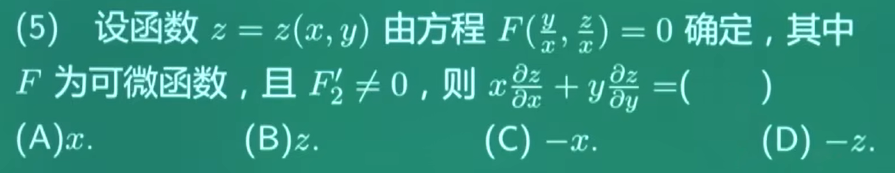

#### 1.什么是偏导

- \(\boldsymbol{\dfrac{d}{dx}}\)：**一元函数普通导数**，函数只有 x 一个变量，所有变量都跟着 x 一起变
- \(\boldsymbol{\dfrac{\partial}{\partial x}}\)：**多元函数偏导数**，函数有 \(x,y,z\) 等多个变量，只让 x 变化，其余变量固定为常数
- 例：\(z=x^2+3xy\)，对 x 偏导：\(\dfrac{\partial z}{\partial x}=2x+3y\)
  - 其实就是对 \(x^2\) 求导再对 \(3xy\) 求导，y是常数

#### 2.什么是可微

- 在曲线某一个点附近取很小一段，改用这个点上的切线（一条笔直的直线）去代替这段曲线做估算

- 一元函数可微：\(\Delta y = A\Delta x + o(\Delta x)\)

- \(o(\Delta x)\) **不是某一个固定函数**，而是一类函数的统称，若函数 \(\alpha(\Delta x)\) 满足：\(\lim_{\Delta x \to 0}\frac{\alpha(\Delta x)}{\Delta x}=0\)，我们就记 \(\boldsymbol{\alpha(\Delta x)=o(\Delta x)}\)

  - \(o(\Delta x)\) **是 \(\Delta x\) 的高阶无穷小**
  - 设 \(\Delta x\to0\)：
  - \(\alpha_1=(\Delta x)^2\)：\(\displaystyle \lim_{\Delta x\to0}\frac{(\Delta x)^2}{\Delta x}=\lim \Delta x=0\)，所以 \((\Delta x)^2=o(\Delta x)\)
  - \(\alpha_2=5(\Delta x)^3\)：\(\displaystyle \lim_{\Delta x\to0}\frac{5(\Delta x)^3}{\Delta x}=0\)，所以 \(5(\Delta x)^3=o(\Delta x)\)
  - \(\alpha_3=\sin(\Delta x)^2\)：同样极限为 0，也属于 \(o(\Delta x)\)
    - 当 \(t\to0\) 时，等价无穷小公式：\(\sin t \sim t\)。令 \(t=(\Delta x)^2\)，当 \(\Delta x\to0\) 时，\(t=(\Delta x)^2\to0\)，因此：\(\sin\left((\Delta x)^2\right) \sim (\Delta x)^2\)
    - 替换后极限变为：\(\lim_{\Delta x \to 0}\frac{(\Delta x)^2}{\Delta x} =\lim_{\Delta x \to 0}\Delta x =0\)

- 如果没有 \(o(\Delta x)\)，等式根本不成立

  - 举个最简单的例子：\(y=x^2\)，取某点 x，给 x 增加一小段 \(\Delta x\)
  - 真实变化量：\(\Delta y=(x+\Delta x)^2 - x^2 = 2x\cdot\Delta x + (\Delta x)^2\)
  - 对比标准式 \(\Delta y=A\Delta x + o(\Delta x)\)：这里 \(A=2x\)，误差项就是 \((\Delta x)^2\)，而 \((\Delta x)^2=o(\Delta x)\)

  - 只写 \(\Delta y=A\Delta x\) 是错的，左边是真实变化，右边只是直线近似，二者天生差一块
  - 必须把差值 \((\Delta x)^2\) 写进等式，才能让左右严格相等，这一块差值就用 \(o(\Delta x)\) 统一表示
  - **高阶无穷小**（\(o(\Delta x)\)），这个约束是 “可微” 的灵魂：

#### 3.什么是微分

- 把式子\(\Delta y = A\Delta x + o(\Delta x)\)里面线性主部 \(A\Delta x\) 单独取名叫做微分 dy
- 又因为 \(A=f'(x)\)、规定自变量微分 \(dx=\Delta x\)，所以标准写法：\(dy = f'(x) dx\)
- 